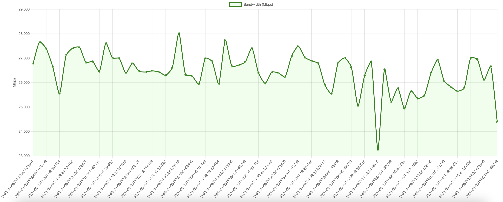

# Telecom Network Monitor

[](https://github.com/<adnansamore>/telecom-network-monitor/actions/workflows/ci.yml)


A containerized **telecommunication network monitoring system** built with **Python, Flask, Docker, and Chart.js**.  
It collects real-time metrics (latency, packet loss, bandwidth), stores them in SQLite, and visualizes results on a live web dashboard.  
Includes **alerts**, **CI/CD automation**, and **containerized deployment** for easy scalability.  

---

##  Features
- **Latency Monitoring** — Ping multiple hosts and measure response time.  
- **Failure Detection** — Visualize failed pings with red-filled areas.  
- **Bandwidth Tests** — Integrated iperf3 server + client for throughput measurement.  
- **Web Dashboard** — Real-time charts powered by Flask + Chart.js.  
- **Alerts** — Console alerts + optional Slack notifications.  
- **Containerized** — Runs fully with Docker Compose.  
- **CI/CD** — GitHub Actions pipeline for testing and Docker builds.  

---

## Project Structure
telecom-network-monitor/
├── docker-compose.yml
├── README.md
├── .gitignore
├── .dockerignore
│
├── services/
│   ├── collector/                  (ping, iperf, alerts)
│   │   ├── Dockerfile
│   │   ├── requirements.txt
│   │   ├── collector.py
│   │   ├── utils.py
│   │   ├── alerts.py
│   │   ├── config.yaml
│   │   └── tests/
│   │       └── test_utils.py
│   │
│   └── dashboard/                   (Flask + Chart.js)
│       ├── Dockerfile
│       ├── requirements.txt
│       ├── app.py
│       └── templates/
│           ├── index.html
│           └── style.css
│
└── .github/
    └── workflows/
        └── ci.yml                   (GitHub Actions CI pipeline)


---

## Quick Start

### 1. Clone the repository
```bash
git clone https://github.com/<your-username>/telecom-network-monitor.git
cd telecom-network-monitor
```

### 2. (Optional) Configure Slack Alerts
```bash
SLACK_WEBHOOK_URL=https://hooks.slack.com/services/XXX/YYY/ZZZ
```
    If not set, alerts will just print in the console.

### 3. Start the stack
```bash
docker compose up -d --build
```
This spins up:
    collector -> Pings targets + runs iperf tests
    iperf -> Local iperf3 server for bandwidth testing
    dashboard → Web dashboard on port 8000


### 4. Open the Dashboard
Macos
```bash
open http://localhost:8000
```
or just open the browser and copy paste link there.

You’ll see:

    Blue-filled chart for latency (successful pings).
    Red-filled sections for failed pings.
    Green-filled chart for bandwidth.




### 5. Logs
```bash
docker compose logs -f collector
```

## Running Tests
It's good to create python virtual environments instead of installing requirements globally on local machine.
    - If you are new to virtual environments, check out this guide I wrote:
        [Understanding Python Virtual Environments](https://adnansamore.github.io/posts/python-virtual-env/)

```bash
python -m venv .venv
source .venv/bin/activate
cd services/collector
pip install -r requirements.txt
pytest -q
```
## CI/CD
GitHub Actions workflow (.github/workflows/ci.yml):

- Runs unit tests.
- Builds Docker images on each push or PR.

## Stopping 
``` bash
# Stop containers
docker compose down

# Stop + remove volumes (wipes DB)
docker compose down -v
```

## Tech Stack

    Python 3.11 (Flask, SQLAlchemy, PyYAML, requests)
    Docker & Docker Compose
    SQLite (lightweight storage)
    Chart.js (interactive charts)
    GitHub Actions (CI pipeline)

## Author

Adnan Samore

- BSc Computer Science @ ELTE Budapest

- Passionate about AI, Cloud, and Software Development
